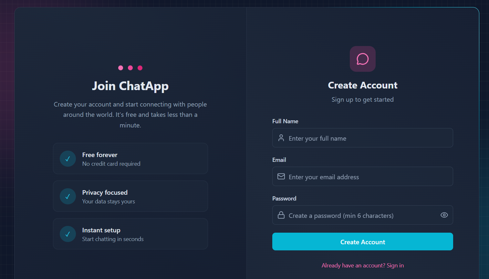

# ChatApp 💬

A modern, real-time chat application built with the MERN stack and Socket.IO.



## ✨ Features

- **Real-time Messaging** - Instant message delivery using Socket.IO
- **User Authentication** - Secure JWT-based authentication with httpOnly cookies
- **Online Status** - See who's online in real-time
- **Image Sharing** - Share images in conversations (Cloudinary integration)
- **Beautiful UI** - Modern, responsive design with Tailwind CSS & DaisyUI
- **Rate Limiting** - Protected against abuse with Arcjet
- **Welcome Emails** - Automated welcome emails for new users (Resend)

## 🔒 Security Features

- **HTTP-only Cookies** - JWT stored securely, not accessible via JavaScript
- **Password Hashing** - bcryptjs with 10 salt rounds
- **Helmet.js** - Security headers (XSS, MIME sniffing, clickjacking protection)
- **Rate Limiting** - Arcjet protection against brute force attacks
- **Input Validation** - Server-side validation on all endpoints
- **CORS Configuration** - Strict origin policy
- **MongoDB ObjectId Validation** - Prevents NoSQL injection
- **Image Upload Validation** - File type and size restrictions
- **SameSite Cookies** - CSRF protection
- **Non-root Docker User** - Container security best practice

## 🛠️ Tech Stack

### Backend

- **Node.js** & **Express** - Server framework
- **MongoDB** & **Mongoose** - Database
- **Socket.IO** - Real-time communication
- **JWT** - Authentication
- **Helmet** - Security middleware
- **Cloudinary** - Image storage
- **Arcjet** - Rate limiting & bot protection
- **Resend** - Email service

### Frontend

- **React 19** - UI library
- **Vite** - Build tool
- **Tailwind CSS** & **DaisyUI** - Styling
- **Zustand** - State management
- **Socket.IO Client** - Real-time connection
- **Lucide React** - Icons

## 📁 Project Structure

```
chatApp/
├── backend/
│   ├── src/
│   │   ├── controllers/     # Route handlers
│   │   ├── emails/          # Email templates
│   │   ├── lib/             # Utilities (db, cloudinary, socket)
│   │   ├── middleware/      # Auth, rate limiting
│   │   ├── models/          # MongoDB schemas
│   │   ├── routes/          # API routes
│   │   └── server.js        # Entry point
│   ├── Dockerfile
│   └── package.json
├── frontend/
│   ├── src/
│   │   ├── components/      # React components
│   │   ├── lib/             # Axios instance, utils
│   │   ├── pages/           # Page components
│   │   ├── store/           # Zustand stores
│   │   ├── App.jsx          # Main app
│   │   └── main.jsx         # Entry point
│   ├── Dockerfile
│   ├── nginx.conf
│   └── package.json
├── docker-compose.yml
├── .env.example
└── README.md
```

## 🚀 Getting Started

### Prerequisites

- Node.js 18+
- MongoDB (local or Atlas)
- Cloudinary account
- (Optional) Resend account for emails
- (Optional) Arcjet account for rate limiting

### Environment Variables

Create a `.env` file in the `backend` folder:

```env
# Server
PORT=3000
NODE_ENV=development

# Database
MONGO_URI=mongodb://localhost:27017/chatapp

# JWT
JWT_SECRET=your_super_secret_jwt_key_here

# Cloudinary
CLOUDINARY_CLOUD_NAME=your_cloud_name
CLOUDINARY_API_KEY=your_api_key
CLOUDINARY_API_SECRET=your_api_secret

# Resend (Optional)
RESEND_API_KEY=your_resend_api_key
CLIENT_URL=http://localhost:5173

# Arcjet (Optional)
ARCJET_KEY=your_arcjet_key
```

### Local Development

1. **Clone the repository**

   ```bash
   git clone https://github.com/yourusername/chatapp.git
   cd chatapp
   ```

2. **Install backend dependencies**

   ```bash
   cd backend
   npm install
   ```

3. **Install frontend dependencies**

   ```bash
   cd ../frontend
   npm install
   ```

4. **Start the development servers**

   Backend (from `backend` folder):

   ```bash
   npm run dev
   ```

   Frontend (from `frontend` folder):

   ```bash
   npm run dev
   ```

5. **Open your browser**

   Navigate to `http://localhost:5173`

## 🐳 Docker Deployment

### Quick Start with Docker Compose

1. **Copy environment file**

   ```bash
   cp .env.example .env
   ```

2. **Edit `.env` with your values**

   ```bash
   # Required: Set a strong JWT secret
   JWT_SECRET=your_super_secret_jwt_key_change_this

   # Required: Cloudinary credentials
   CLOUDINARY_CLOUD_NAME=your_cloud_name
   CLOUDINARY_API_KEY=your_api_key
   CLOUDINARY_API_SECRET=your_api_secret

   # Optional: MongoDB credentials (defaults provided)
   MONGO_USERNAME=admin
   MONGO_PASSWORD=your_secure_password
   ```

3. **Build and run**

   ```bash
   docker-compose up -d --build
   ```

4. **Access the application**

   Open `http://localhost` in your browser

### Docker Commands

```bash
# Build and start all services
docker-compose up -d --build

# View logs
docker-compose logs -f

# Stop all services
docker-compose down

# Stop and remove volumes (clears database)
docker-compose down -v

# Rebuild a specific service
docker-compose up -d --build backend
```

### Production Considerations

- Use a reverse proxy (Traefik, Nginx) with SSL/TLS
- Set strong, unique passwords for MongoDB
- Use Docker secrets for sensitive environment variables
- Enable MongoDB authentication and network restrictions
- Set up proper logging and monitoring
- Consider using a managed MongoDB service (Atlas)

## 📝 API Endpoints

### Authentication

- `POST /api/auth/register` - Create new account
- `POST /api/auth/login` - Login
- `POST /api/auth/logout` - Logout
- `GET /api/auth/check` - Check authentication status
- `PUT /api/auth/update-profile` - Update profile picture

### Messages

- `GET /api/messages/contacts` - Get all users
- `GET /api/messages/chats` - Get chat partners
- `GET /api/messages/:id` - Get messages with user
- `POST /api/messages/send/:id` - Send message

### Health

- `GET /api/health` - Health check endpoint

## 🎨 Customization

### Themes

The app uses a slate/cyan color scheme. Modify `tailwind.config.js` to customize colors.

### Animations

Border animations are defined in `index.css` using CSS custom properties.

## 📄 License

MIT License - feel free to use this project for learning or production!

## 🤝 Contributing

1. Fork the repository
2. Create your feature branch (`git checkout -b feature/amazing-feature`)
3. Commit your changes (`git commit -m 'Add amazing feature'`)
4. Push to the branch (`git push origin feature/amazing-feature`)
5. Open a Pull Request

## 🙏 Acknowledgments

- [Socket.IO](https://socket.io/) for real-time capabilities
- [Tailwind CSS](https://tailwindcss.com/) for utility-first styling
- [DaisyUI](https://daisyui.com/) for component library
- [Lucide](https://lucide.dev/) for beautiful icons

---

Made by mannan
